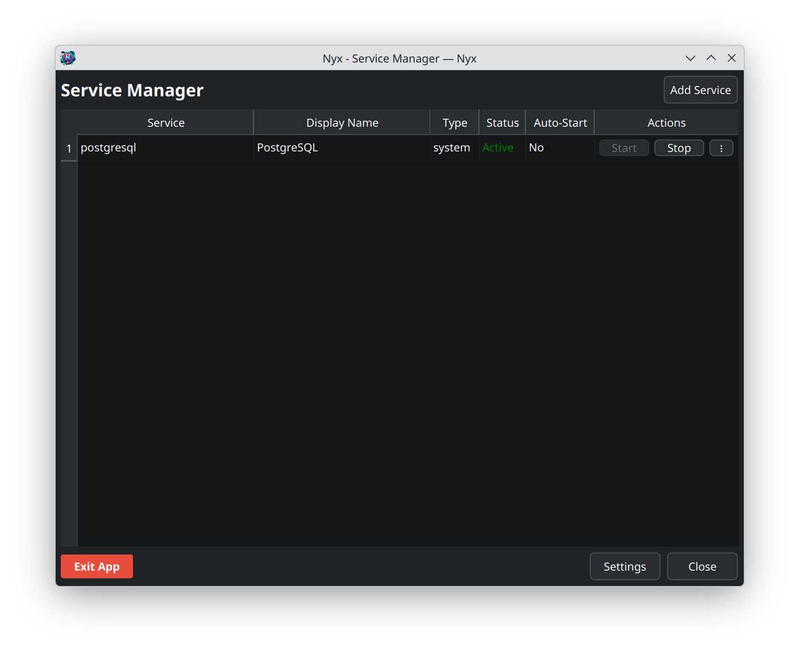
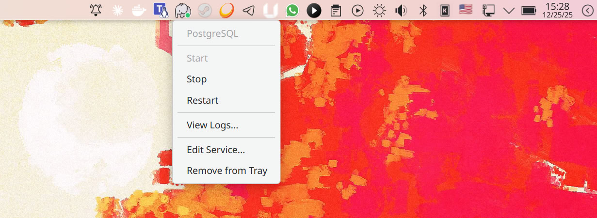

<div align="center">
  

  # Nyx

  A modern system tray application for managing systemd services. Built with PyQt6 and tested on KDE Plasma and GNOME.
</div>

## Features

-  **System Tray Integration** - Manage services directly from your system tray
-  **Real-time Monitoring** - Live status updates with color-coded indicators
-  **Desktop Notifications** - Get notified when service status changes
-  **Custom Icons** - Set custom icons for each service (PNG, SVG)
-  **Passwordless Mode** - Use PolicyKit for password-free service management
-  **Log Viewer** - View systemd logs for your services
-  **Management Window** - Full-featured window for managing all services
- ️ **Quick Settings** - Access settings directly from tray icon menu
-  **Autostart Support** - Automatically start on login
-  **Dual Service Support** - Manage both user and system services

## Screenshots

<div align="center">
  
  <p><em>Main management window</em></p>
</div>

<div align="center">
  
  <p><em>System tray integration</em></p>
</div>

<div align="center">
  
  <p><em>Add service dialog</em></p>
</div>

## Installation

### From .deb Package

```bash
sudo dpkg -i nyx_1.0.0_all.deb
sudo apt-get install -f 
```

### From Source

```bash
pip install -e .
```

## Usage

### Launch from Menu
Find "Nyx" in your application menu under System.

### Command Line Options

```bash
# Show management window on startup
nyx --show-window

# Hide main tray icon (only show service icons)
nyx --no-tray

# Started from autostart (used internally by autostart)
nyx --startup

# Window-only mode (no tray icons)
nyx --show-window --no-tray
```

## Building from Source

### Build .deb Package

```bash
./build-deb.sh
```

### Requirements
- Python 3.10+
- PyQt6
- PyYAML
- systemd

## Configuration

Configuration is stored in `~/.config/nyx/config.yaml`

Service icons are stored in `~/.config/nyx/icons/`

## Contributing

Contributions are welcome! Please feel free to submit issues and pull requests.

## License

MIT License - see LICENSE file for details
